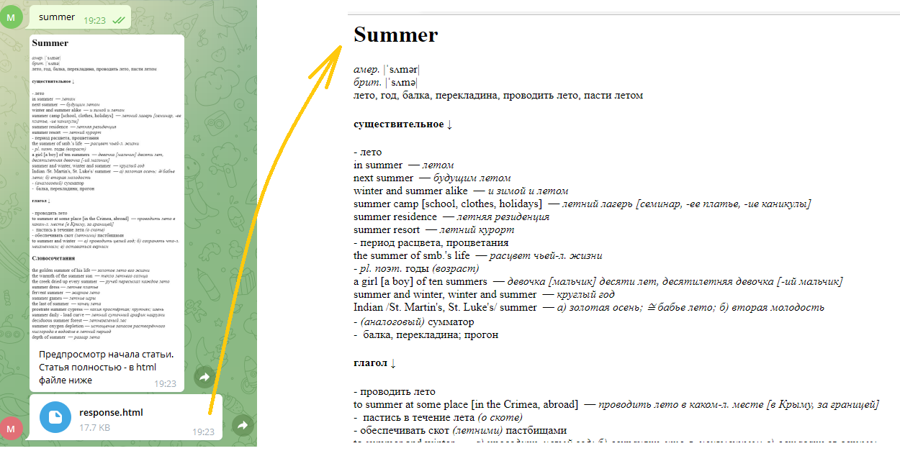
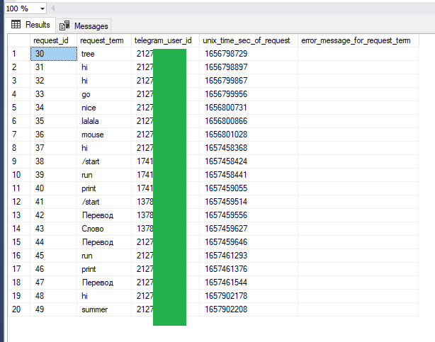

Запускать файл '\_\_\_telegram\_bot\_v6\_(iz\_v5\_plus\_sql).py'

Бот присылает перевод слов и фраз, которые пользователь печатает в чате с ботом.

Перевод возможен с русского на английский и с английского на русский.

Для получения перевода слова используется сайт wooordhunt.ru
(исключительно в учебных целях).

Используются модули requests, bs4.BeautifulSoup, json, pyodbc, html2image и др.

У Телеграм есть ограничения на размер отправляемых изображений и текстовых сообщений, 
поэтому в ответ на запрос пользователь вначале получает изображение с началом словарной статьи, а затем может открыть полный текст в виде html файла:

Текст запроса, время и id пользователя Телеграм сохраняются в базу данных MS SQL (дальнейшей обработки пока нет):

